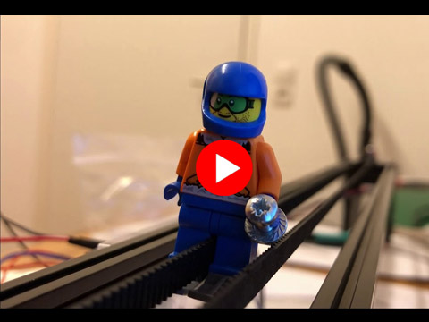
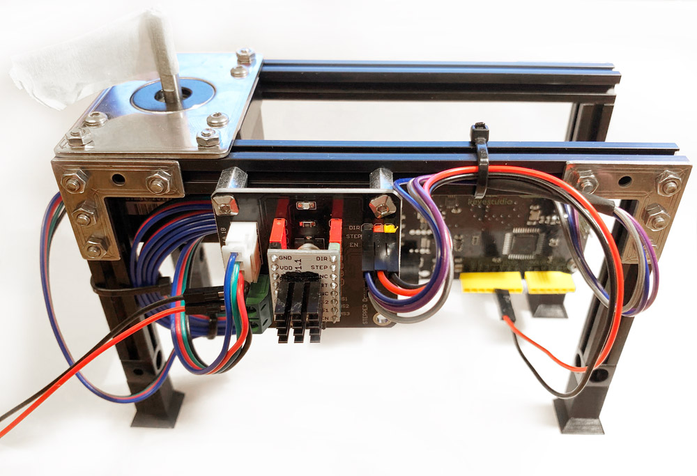

# Nager.ArduinoStepperMotor

This project was developed to control a stepper motor smoothly and to adjust the speed during operation. Most of the libaries I tested at that time had an acceleration curve but always stopped when changing to another speed and then started again. There are two ways to communicate with the Arduino, one is via serial communication or by using a network module. If you have difficulties and the motor only whistles you should adjust the acceleration curve in the Arduino file.

## Project Skier Simulator

 
Watch the video on Youtube

### Serial Commands (Baudrate 115200)

Command | Description | 
--- | --- | 
`enablemotordriver` | Enable the motor driver, the motor has voltage
`disablemotordriver` | Disable the motor driver, the motor has no voltage
`speed` | Values between -255 and 255
`limitenable` | The motor can only move between the limits
`limitdisable` | No limits active
`setlimitleft` | Set the current position as left limit
`setlimitright` | Set the current position as right limit
`step` | Motor move one step
`ramp` | Returns the current ramp
`setramp` | Set a new ramp (setramp=0008000) rampIndex 0 -> 8000

### Required Hardware

Quantity | Product | 
--- | --- | 
1x | [A4988 Stepper Driver Control Expansion Board](https://amzn.to/2X9j6cO) |
1x | [UEETEK 4 Stück 1M Stepper Motor Cable HX2.54 4-pin to 6-pin](https://amzn.to/31w3uz7) |
1x | [Usongshine Stepper Motor Nema 17 1.5A 17HS4401S](https://amzn.to/2KO4jO8) |
1x | [PChero Mechanic Endstop with LED Indicator](https://amzn.to/2UIAZh4) |

## Test Software

For control via serial communication I have developed a small test application.

