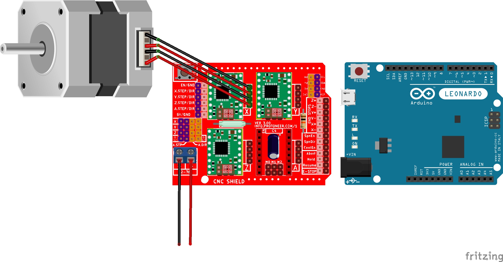
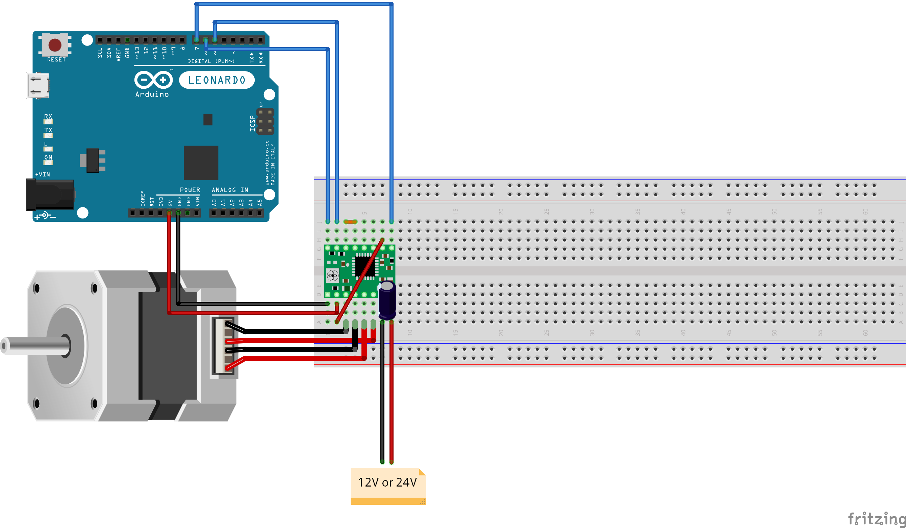
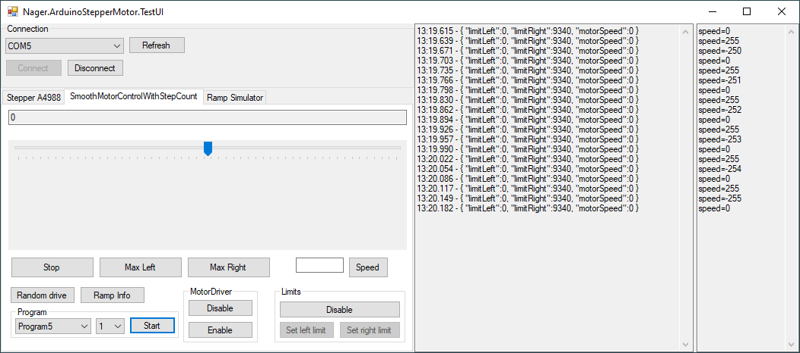

# Nager.ArduinoStepperMotor
C# control a stepper motor via Serial Port communication

## Project 1

### Serial Commands (Baudrate 115200)

Command | Description | 
--- | --- | 
`start` | Enable the motor driver, the motor has voltage
`stop` | Disable the motor driver, the motor has no voltage
`move=500` | Move the motor for 500 steps
`speed=200` | Change the rpm (rotation per minute) to the new value

### Required Hardware

Quantity | Product | 
--- | --- | 
1x | [Akozon Automatic Ball Screw Linear CNC Slide Stroke Long Stage Actuator Guide Slide Table Aluminum with Stepper Motor 400mm Effective Range](https://amzn.to/2uOP0eR) |
1x | [PChero Mechanic Endstop with LED Indicator](https://amzn.to/2UIAZh4) |
1x | [Quimat Arduino CNC Shield Kit with Stepper Motor](https://amzn.to/2I4SG4M) |

## Project 2

### Serial Commands (Baudrate 115200)

Command | Description | 
--- | --- | 
`enablemotordriver` | Enable the motor driver, the motor has voltage
`disablemotordriver` | Disable the motor driver, the motor has no voltage
`speed` | Values between -255 and 255
`limitenable` | The motor can only move between the limits
`limitdisable` | No limits active
`setlimitleft` | Set the current position as left limit
`setlimitright` | Set the current position as right limit
`step` | Motor move one step
`ramp` | Returns the current ramp
`setramp` | Set a new ramp (setramp=0008000) rampIndex 0 -> 8000

### Required Hardware

Quantity | Product | 
--- | --- | 
1x | [A4988 Stepper Driver Control Expansion Board](https://amzn.to/2X9j6cO) |
1x | [UEETEK 4 Stück 1M Stepper Motor Cable HX2.54 4-pin to 6-pin](https://amzn.to/31w3uz7) |
1x | [Usongshine Stepper Motor Nema 17 1.5A 17HS4401S](https://amzn.to/2KO4jO8) |

